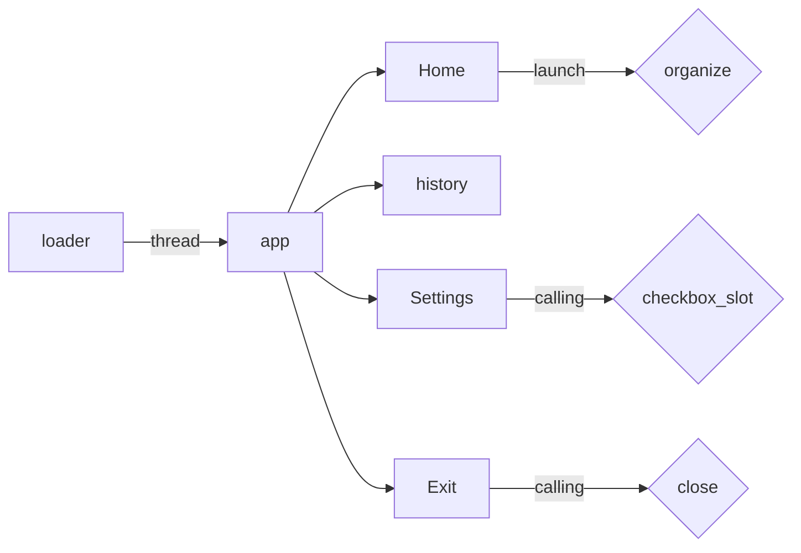

# Welcome to File Meticulous!

**File Meticulous** is a powerful tool that helps you keep all your files organized and easy to find. With its user-friendly interface, you can sort and categorize in just a few clicks. Say goodbye to cluttered and disorganized files, and hello to a more efficient and streamlined system. Get started today and bring organization to your laptop

# Take in charge

File Meticulous is focused on sorting and organizing your files with ease. To do this, simply navigate to the parameters section and specify the type of files you want to sort and organize. Then, specify the location of these files, such as documents, pictures, desktop, download, music, or videos. Finally, go to the home section and click on the launch button to start the process.

##  The menu

The interface features a menu for user interaction, consisting of the following options: Home, History, Settings, and Close
-	`Home`  To make the organizing process even quicker and simpler, simply click on the launch button within the Home section. This will automatically sort and organize the files that have been previously defined in the Settings.
-	`History` This section will provide feedback for each file transfer, allowing you to track the progress of your file organization.
-	`Settings` The Settings section allows you to customize your file organization process to meet your specific needs. In this section, you can define the types of files you want to sort and organize
-	`Close` stop running the application

# Execution process

Here's a brief explanation of the different components in the diagram:

-   `A[loader]`: This node represents the loading component of the software system.
    
-   `B[app]`: This node represents the main application.
    
-   `C[Home]`: This node represents the Home section of the application, where the user can initiate the file organizing process.
    
-   `D{organize}`: This node represents the process of organizing files.
    
-   `E[history]`: This node represents the history section of the application, where the user can view the history of previous file organizing processes.
    
-   `F[Settings]`: This node represents the Settings section of the application, where the user can customize the file organizing process.
    
-   `G{checkbox_slot}`: This node represents a checkbox in the Settings section, where the user can select specific options.
    
-   `H[Exit]`: This node represents the Exit button in the application.
    
-   `I{close}`: This node represents the action of closing the application.

The arrows in the diagram represent the flow of information or control between the different components. For example, the arrow from the `loader` node to the `app` node represents the flow of control from the loading component to the main application. The arrow from the `Home` node to the `organize` node represents the flow of control from the Home section to the process of organizing files. The arrow from the `Settings` node to the `checkbox_slot` node represents the flow of control from the Settings section to a checkbox in the Settings section.
